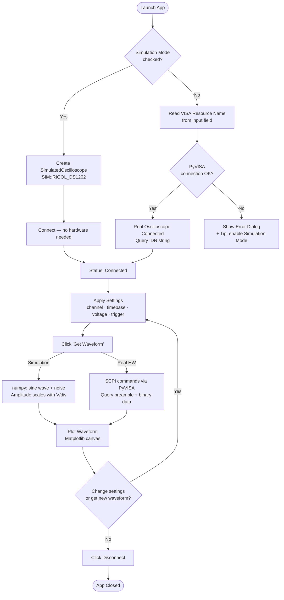

# Instrument Test Automation GUI — Oscilloscope Control & Waveform Capture

> **Built by Mohammed Abdul Fahad** — Data Scientist & Test Automation Engineer  
> 📧 mohammedabdulfahad819@gmail.com | 📞 (346) 494-6645 | Houston, TX  
> 🔗 [linkedin.com/in/fahad346](https://linkedin.com/in/fahad346)

---

## What Is This Project?

This is a **desktop application** that lets you connect to a lab oscilloscope, configure its settings, and see the waveform (signal) it's measuring — all from your computer screen, without touching the oscilloscope's physical buttons.

Think of it like a **remote control for your oscilloscope**, with a live graph that updates every time you click "Get Waveform".

**No oscilloscope? No problem.** The app has a built-in **Simulation Mode** that generates a realistic fake signal so you can run and demo the app on any laptop.

---

## Why I Built This

I built this project to solve a real problem I've seen in **manufacturing and production test environments**:

- Engineers waste time manually adjusting oscilloscope knobs and writing down readings
- Test setups are hard to repeat consistently across shifts or operators
- Debugging test failures is slow when there's no easy way to capture and review waveforms

This GUI **automates the setup and data capture** — you configure it once, click a button, and get your waveform data instantly. It also includes simulation mode so developers can build and test the software without needing the physical instrument on their desk.

---

## How It Works — Flow Diagram



---

## Features

| Feature | Description |
|---|---|
| 🔌 Connect / Disconnect | Connects to any VISA-compatible oscilloscope over USB/GPIB |
| 📺 Channel Selection | Choose CH1–CH4 |
| ⏱ Timebase | Set seconds-per-division (1 ns to 10 s) |
| ⚡ Voltage Scale | Set volts-per-division (1 mV to 100 V) |
| 🎯 Trigger Control | Mode (EDGE/PULSE/VIDEO), source, slope, level |
| 📈 Live Waveform Plot | Real-time Matplotlib graph with grid, labels, zoom |
| 🎨 Custom Waveform Color | Pick any color for the plotted signal |
| 🧪 Simulation Mode | Full demo without any hardware — sine + noise waveform |
| ⚠️ Error Handling | Clean error dialogs with actionable tips for operators |

---

## Run Locally (Windows)

### 1. Install dependencies

```powershell
pip install -r requirements.txt
```

### 2. Launch the app

```powershell
python oscilloscope-interface.py
```

### 3. Without a physical oscilloscope

1. Check **"Simulation Mode (no hardware)"** at the top of the window
2. Click **Connect** → status shows `Connected (Simulation) — SIM::RIGOL_DS1202`
3. Click **Get Waveform** → a 1 kHz sine wave with noise appears
4. Change **Voltage Scale (V/div)** and click **Get Waveform** again → amplitude changes

### 4. With a real oscilloscope (RIGOL DS1202 or compatible)

1. Connect the oscilloscope via USB
2. Enter the VISA resource name (e.g. `USB0::0x1AB1::0x0517::DS1ZE242906834::INSTR`)
3. Click **Connect**, then **Get Waveform**

---

## Requirements

```
PyQt5 >= 5.15
pyvisa >= 1.13
numpy >= 1.21
matplotlib >= 3.5
Python 3.6+
```

Install all at once:
```powershell
pip install -r requirements.txt
```

---

## Project Structure

```
oscilloscope-interface.py   # Main application (GUI + logic)
requirements.txt            # Python dependencies
README.md                   # This file
code-explanation.md         # Detailed code walkthrough
LICENSE                     # MIT License
```

---

## Code Architecture

```
oscilloscope-interface.py
│
├── class Oscilloscope           # Real hardware — PyVISA SCPI commands
│   ├── connect() / disconnect()
│   ├── set_channel / set_timebase / set_voltage_scale / set_trigger
│   └── get_waveform()           # Queries preamble + binary data
│
├── class SimulatedOscilloscope  # Fake instrument — no hardware needed
│   ├── connect() / disconnect() # Print-only, no VISA calls
│   ├── set_* methods            # Store state, no-ops otherwise
│   └── get_waveform()           # numpy sine + Gaussian noise
│
├── class MplCanvas              # Matplotlib figure embedded in Qt
│   └── Axes with dark background, grid, labels
│
└── class MainWindow             # PyQt5 GUI
    ├── _setup_ui()              # Builds all widgets and layouts
    ├── connect_oscilloscope()   # Branches on simulation checkbox
    ├── apply_settings()         # Sends settings to real or simulated scope
    ├── get_waveform()           # Fetches + plots data
    └── plot_waveform()          # Renders on MplCanvas
```

---

## Skills Used

| Category | Technologies |
|---|---|
| **GUI Development** | PyQt5 (QMainWindow, QComboBox, QDoubleSpinBox, QCheckBox, QColorDialog) |
| **Instrument Control** | PyVISA, SCPI commands (`:WAV:`, `:TIM:`, `:TRIG:`, `:CHAN:`) |
| **Data Processing** | NumPy (binary waveform decoding, preamble parsing, sine generation) |
| **Visualization** | Matplotlib embedded in Qt (FigureCanvasQTAgg) |
| **Software Design** | OOP, duck-typing for real/simulated instrument swap |
| **Error Handling** | Try/except with user-friendly Qt dialogs and actionable tips |
| **Version Control** | Git, GitHub |

---

## About the Author

**Mohammed Abdul Fahad**  
📧 mohammedabdulfahad819@gmail.com | 📞 (346) 494-6645 | Houston, TX  
🔗 [linkedin.com/in/fahad346](https://linkedin.com/in/fahad346)

### Education
- **M.S. Data Science** — University of Houston, Cullen College of Engineering *(GPA: 3.66/4.0, May 2024)*  
  *Coursework: Machine Learning, Cloud Computing, Information Visualization, Text Mining, Big Data Analytics, AI for Engineers*
- **B.Tech Electrical & Electronics Engineering** — JNTU Hyderabad, India *(GPA: 4.0/4.0, May 2019)*  
  *Merit Cum Means Scholarship by Govt of India*

### Professional Background

I'm a **Data Scientist and Test Automation Engineer** with a background spanning manufacturing, ML, and instrument control. This project sits at the intersection of my EE degree (understanding oscilloscopes and signals) and my software skills (Python, PyQt5, data pipelines).

**Relevant experience:**

- **Data Analyst @ Growth Wireless LLC** *(Feb 2025–Present)*  
  Built 15+ Power BI/Tableau dashboards; designed Python data validation scripts for manufacturing metrics; applied XGBoost/Random Forest for predictive modeling.

- **Jr. Software Developer @ Kalsoftech LLC** *(Sep 2024–Feb 2025)*  
  Engineered ETL pipelines in Python & SQL; built AI-enhanced data visualizations; automated reporting workflows.

- **ML Data Associate @ Amazon** *(Aug 2020–Jun 2022)*  
  Managed 2M+ record datasets; automated data preprocessing with Python; implemented SQL-based ETL with ML-powered quality validation; analyzed production throughput to identify bottlenecks.

### Related Projects

| Project | Description |
|---|---|
| **SCPI Instrument Control Toolkit** | Automated oscilloscope workflows via PyVISA/SCPI; dry-run support with fake VISA layer for CI |
| **AI Anomaly Detection for Production Data** | Unsupervised One-Class SVM pipeline on multi-sensor data to flag abnormal runs and support QA |

### Technical Skills

```
Test Automation:   Python (PyVISA, PySerial, SCPI), PyQt5, LabVIEW (exposure)
Instruments:       Oscilloscopes, Power Meters, Signal Generators, TCP/IP, GPIB
Data Engineering:  Pandas, NumPy, SQL, ETL Pipelines, Statistical Analysis
Visualization:     Tableau, Power BI, Matplotlib, Amazon QuickSight
ML & AI:           Scikit-learn, TensorFlow, Anomaly Detection, Predictive Maintenance
DevOps:            Git, CI/CD, Docker, Linux/Bash, JIRA, Agile
```

---

## License

MIT License — see [LICENSE](LICENSE) for details.
